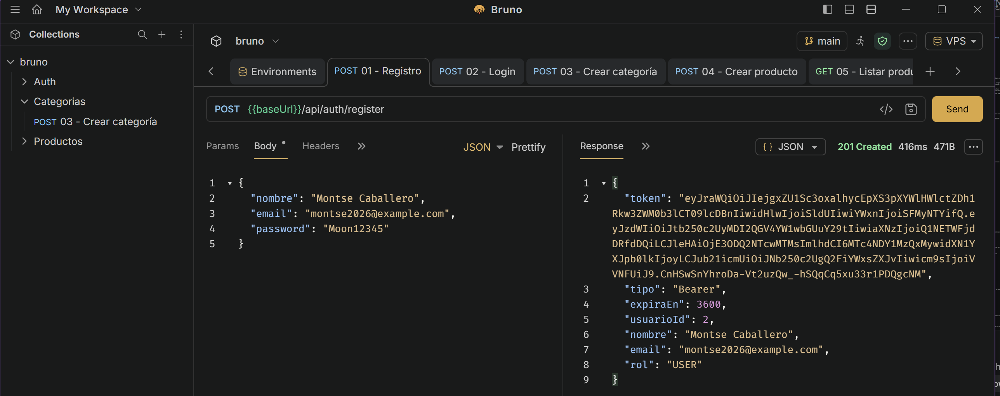
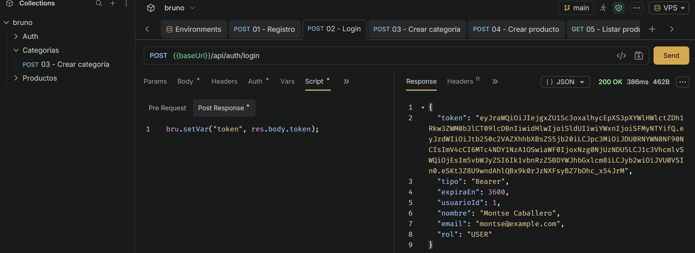
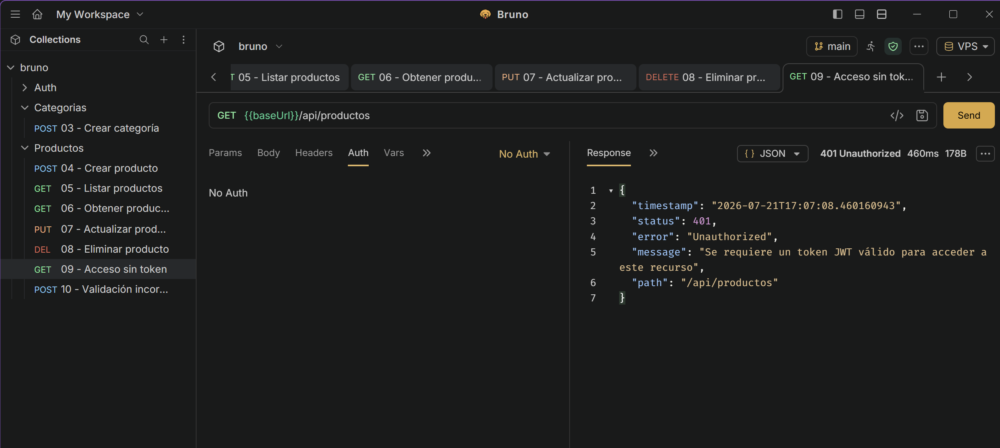
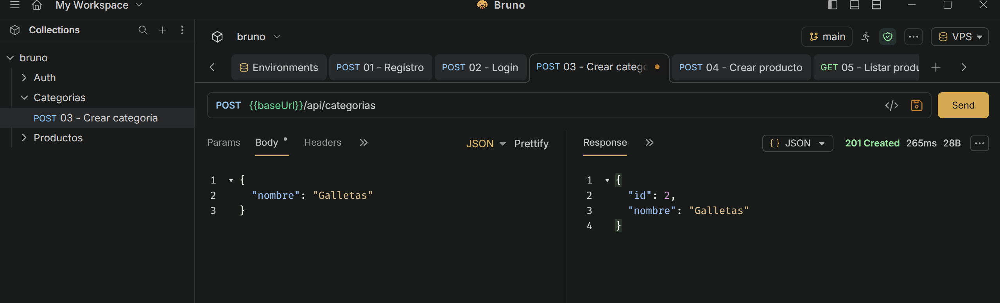
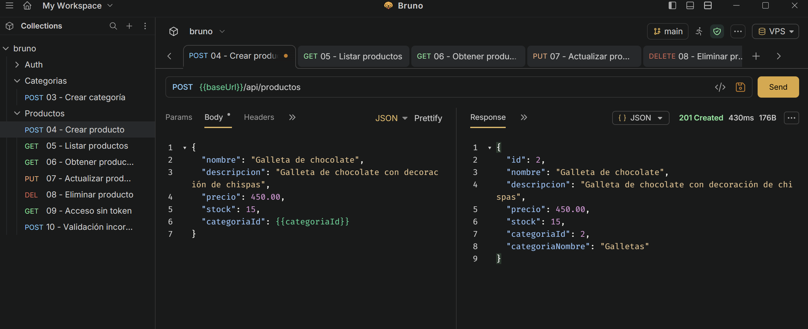
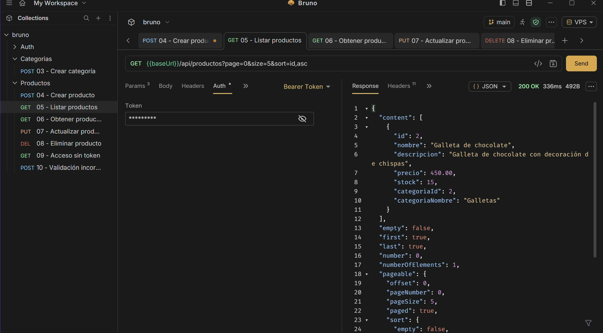
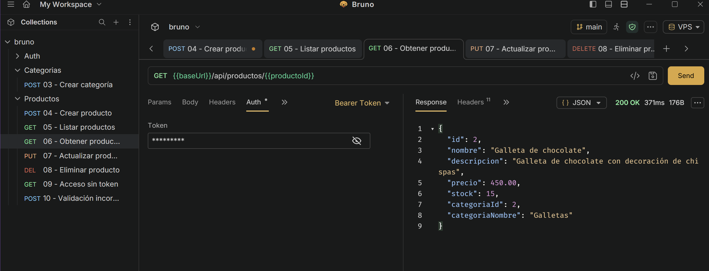
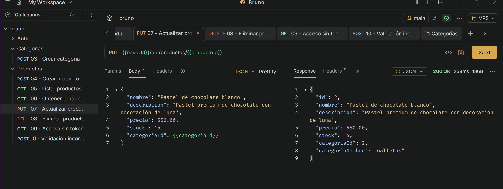
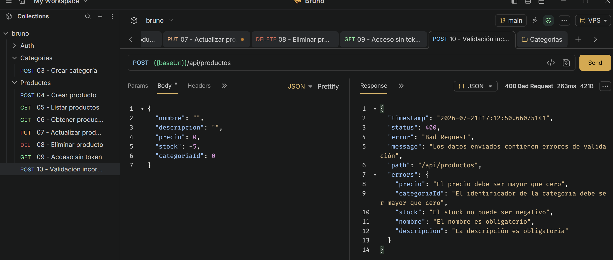

<div align="center">

# DULCE LUNA API

## API REST CON SPRING BOOT, SPRING SECURITY, JWT Y MYSQL

### Actividad 4 — Tema 4

<br>

**Tecnológico Nacional de México**  
**Instituto Tecnológico de Oaxaca**

<br>

**Carrera:** Ingeniería en Sistemas Computacionales  
**Estudiante:** Caballero Silva Dalia Montserrat
**Materia:** Programación Web  
**Docente:** Adelina Martínez Nieto

<br>

**Oaxaca de Juárez, Oaxaca — 2026**

</div>

---

## Descripción del proyecto

**Dulce Luna API** es una API REST desarrollada con Java y Spring Boot para administrar productos de una pastelería.

La aplicación implementa autenticación real mediante **Spring Security y JSON Web Tokens (JWT)**. Los usuarios pueden registrarse e iniciar sesión para obtener un token, el cual debe enviarse en las peticiones protegidas mediante el encabezado `Authorization: Bearer`.

La API utiliza una base de datos MySQL y una arquitectura organizada en entidades, DTOs, repositorios, servicios y controladores. Todas las respuestas son enviadas en formato JSON y no se utilizan vistas Thymeleaf.

Las peticiones fueron probadas y documentadas mediante **Bruno**, cuya colección se encuentra incluida en el repositorio.

---

## Objetivos implementados

- Construcción de una API puramente REST.
- Autenticación real con Spring Security y JWT.
- Registro e inicio de sesión de usuarios.
- Protección de endpoints mediante tokens Bearer.
- CRUD completo de productos.
- Paginación en el listado de productos.
- Uso de DTOs para controlar los datos de entrada y salida.
- Validación mediante Bean Validation y `@Valid`.
- Manejo global de errores en formato JSON.
- Persistencia de información con Spring Data JPA y MySQL.
- Relación entre productos y categorías.
- Pruebas de todos los endpoints mediante Bruno.
- Despliegue de la API en un VPS.

---

## Tecnologías utilizadas

- Java 25
- Spring Boot 4.1.0
- Spring Web
- Spring Security
- OAuth2 Resource Server
- JWT con firma HS256
- Spring Data JPA
- Hibernate
- Bean Validation
- MySQL
- Maven
- Bruno
- Git y GitHub
- VPS con Ubuntu

---

## Arquitectura del proyecto

El proyecto utiliza una arquitectura organizada por capas:

```text
src/main/java/com/dulceluna/api
├── config
│   └── SecurityConfig.java
├── controller
│   ├── AuthController.java
│   ├── CategoriaController.java
│   └── ProductoController.java
├── dto
│   ├── auth
│   ├── categoria
│   └── producto
├── entity
│   ├── Categoria.java
│   ├── Producto.java
│   ├── Rol.java
│   └── Usuario.java
├── exception
│   ├── ApiError.java
│   ├── GlobalExceptionHandler.java
│   └── ResourceNotFoundException.java
├── repository
│   ├── CategoriaRepository.java
│   ├── ProductoRepository.java
│   └── UsuarioRepository.java
├── security
│   ├── CustomUserDetailsService.java
│   ├── JwtAuthenticationEntryPoint.java
│   └── JwtService.java
└── service
    ├── AuthService.java
    ├── CategoriaService.java
    └── ProductoService.java
```

---

## Modelo de datos

La API utiliza las siguientes entidades principales:

### Usuario

Representa a las personas que pueden registrarse e iniciar sesión en la API.

Datos principales:

- Identificador.
- Nombre.
- Correo electrónico.
- Contraseña cifrada.
- Rol.

La contraseña nunca se incluye en las respuestas de la API.

### Categoría

Representa una categoría de productos de la pastelería.

Ejemplos:

- Pasteles.
- Cupcakes.
- Galletas.

### Producto

Representa un producto disponible en la pastelería.

Datos principales:

- Identificador.
- Nombre.
- Descripción.
- Precio.
- Stock.
- Categoría.

### Relación

Una categoría puede contener muchos productos y cada producto pertenece a una categoría.

```text
Categoria 1 ───────── N Producto
```

---

## Seguridad y autenticación

Los endpoints de registro y login son públicos:

```text
POST /api/auth/register
POST /api/auth/login
```

Los endpoints de productos y categorías requieren autenticación:

```text
/api/productos/**
/api/categorias/**
```

Después de registrarse o iniciar sesión, la API devuelve un JWT firmado con el algoritmo HS256.

El token contiene información como:

- Correo electrónico del usuario.
- Identificador del usuario.
- Nombre.
- Rol.
- Fecha de emisión.
- Fecha de expiración.
- Emisor.

El token debe enviarse en las peticiones protegidas:

```http
Authorization: Bearer TOKEN_JWT
```

La API no utiliza sesiones del servidor. Cada petición es autenticada de manera independiente mediante el token JWT.

---

## Endpoints de autenticación

### Registrar usuario

```http
POST /api/auth/register
```

Ejemplo de petición:

```json
{
  "nombre": "Dalia Montserrat",
  "email": "montse@example.com",
  "password": "Password123"
}
```

Respuesta esperada:

```text
201 Created
```

### Iniciar sesión

```http
POST /api/auth/login
```

Ejemplo de petición:

```json
{
  "email": "montse@example.com",
  "password": "Password123"
}
```

Respuesta esperada:

```text
200 OK
```

La respuesta incluye un token JWT real para acceder a los endpoints protegidos.

---

## Endpoints de categorías

| Método | Endpoint | Descripción | Estado esperado |
|---|---|---|---|
| GET | `/api/categorias` | Lista las categorías | `200 OK` |
| POST | `/api/categorias` | Crea una categoría | `201 Created` |

Ejemplo para crear una categoría:

```json
{
  "nombre": "Pasteles"
}
```

---

## Endpoints del CRUD de productos

| Método | Endpoint | Descripción | Estado esperado |
|---|---|---|---|
| GET | `/api/productos` | Lista productos con paginación | `200 OK` |
| GET | `/api/productos/{id}` | Obtiene un producto por ID | `200 OK` |
| POST | `/api/productos` | Crea un producto | `201 Created` |
| PUT | `/api/productos/{id}` | Actualiza un producto | `200 OK` |
| DELETE | `/api/productos/{id}` | Elimina un producto | `204 No Content` |

### Crear producto

```http
POST /api/productos
```

Ejemplo:

```json
{
  "nombre": "Pastel de chocolate",
  "descripcion": "Pastel de chocolate con decoración de luna",
  "precio": 450.00,
  "stock": 10,
  "categoriaId": 1
}
```

### Listar productos con paginación

```http
GET /api/productos?page=0&size=5&sort=id,asc
```

Parámetros disponibles:

| Parámetro | Descripción |
|---|---|
| `page` | Número de página comenzando desde cero |
| `size` | Cantidad de elementos por página |
| `sort` | Campo y dirección de ordenamiento |

### Obtener producto por ID

```http
GET /api/productos/{id}
```

### Actualizar producto

```http
PUT /api/productos/{id}
```

Ejemplo:

```json
{
  "nombre": "Pastel de chocolate premium",
  "descripcion": "Pastel premium de chocolate con decoración de luna",
  "precio": 550.00,
  "stock": 15,
  "categoriaId": 1
}
```

### Eliminar producto

```http
DELETE /api/productos/{id}
```

Una eliminación correcta devuelve:

```text
204 No Content
```

---

## Validación de datos

Los DTOs utilizan Bean Validation para impedir que se registren datos incorrectos.

Entre las validaciones utilizadas se encuentran:

- `@NotBlank`
- `@Email`
- `@Size`
- `@NotNull`
- `@DecimalMin`
- `@Min`

Cuando una petición contiene datos inválidos, la API responde con:

```text
400 Bad Request
```

Ejemplo de respuesta:

```json
{
  "status": 400,
  "error": "Bad Request",
  "message": "Los datos enviados contienen errores de validación",
  "path": "/api/productos",
  "errores": {
    "nombre": "El nombre es obligatorio"
  }
}
```

---

## Códigos de estado utilizados

| Código | Significado |
|---|---|
| `200 OK` | Consulta o actualización correcta |
| `201 Created` | Recurso creado correctamente |
| `204 No Content` | Recurso eliminado correctamente |
| `400 Bad Request` | Datos inválidos o JSON incorrecto |
| `401 Unauthorized` | Token ausente, inválido o credenciales incorrectas |
| `404 Not Found` | Producto o categoría inexistente |
| `500 Internal Server Error` | Error inesperado en el servidor |

---

## Colección de Bruno

La colección se encuentra dentro de la carpeta:

```text
/bruno
```

Incluye las siguientes peticiones:

```text
Auth
├── 01 - Registro
└── 02 - Login

Categorias
└── 03 - Crear categoría

Productos
├── 04 - Crear producto
├── 05 - Listar productos
├── 06 - Obtener producto por ID
├── 07 - Actualizar producto
├── 08 - Eliminar producto
├── 09 - Acceso sin token
└── 10 - Validación incorrecta
```

La colección incluye dos entornos:

```text
Local
VPS
```

Direcciones utilizadas:

```text
Local: http://localhost:8088
VPS:   http://54.83.75.25:8088
```

---

# Evidencias de funcionamiento

## 1. Registro de usuario

Petición pública para registrar un usuario y obtener un JWT.



---

## 2. Inicio de sesión

Inicio de sesión con correo y contraseña. La API devuelve un token JWT válido.



---

## 3. Endpoint protegido sin token

Una petición a un endpoint protegido sin enviar un JWT es rechazada con el estado `401 Unauthorized`.



---

## 4. Creación de categoría

Creación de una categoría utilizando autenticación Bearer.



---

## 5. Creación de producto

Operación `POST` para registrar un producto relacionado con una categoría.



---

## 6. Listado paginado de productos

Operación `GET` para consultar productos utilizando paginación.



---

## 7. Consulta de producto por ID

Operación `GET` para consultar un registro individual.



---

## 8. Actualización de producto

Operación `PUT` para modificar un producto existente.



---

## 9. Eliminación de producto

Operación `DELETE` para eliminar un producto. La API responde con `204 No Content`.


---

## 10. Validación de datos

Prueba de datos inválidos, rechazada por las validaciones de los DTOs.



---

## Configuración de la base de datos

La aplicación utiliza variables de entorno para evitar almacenar credenciales reales directamente en el repositorio.

Variables requeridas:

```text
DB_URL
DB_USER
DB_PASSWORD
JWT_SECRET
```

Ejemplo de configuración:

```properties
spring.datasource.url=${DB_URL:jdbc:mysql://localhost:3306/dulce_luna_api_db}
spring.datasource.username=${DB_USER:pasteleria_user}
spring.datasource.password=${DB_PASSWORD}

jwt.secret=${JWT_SECRET}
jwt.expiration=3600
```

La clave definida en `JWT_SECRET` debe tener como mínimo 32 caracteres.

---

## Ejecución local

### Requisitos

- Java 25.
- Maven.
- MySQL.
- Bruno.

### Base de datos

Crear la base de datos:

```sql
CREATE DATABASE dulce_luna_api_db;
```

### Variables de entorno en PowerShell

```powershell
$env:DB_PASSWORD="TU_CONTRASEÑA_MYSQL"
$env:JWT_SECRET="UNA_CLAVE_SECRETA_DE_AL_MENOS_32_CARACTERES"
```


La API queda disponible en:

```text
http://localhost:8088
```

---

## Compilación del archivo JAR


```text
target/CSDMact4_t4-0.0.1-SNAPSHOT.jar
```

---

## Despliegue en VPS

La aplicación fue compilada como archivo JAR y desplegada en un servidor VPS con Ubuntu.

Puerto utilizado:

```text
8088
```

Link base de la API:

```text
http://54.83.75.25:8088
```

Ejemplo de endpoint:

```text
http://54.83.75.25:8088/api/productos
```

El endpoint requiere un token JWT válido.

El proceso se ejecuta de forma independiente a las actividades anteriores y utiliza su propia carpeta y puerto.

---

## Repositorio

```text
https://github.com/MontseCaballero29/CSDMact4_t4
```

